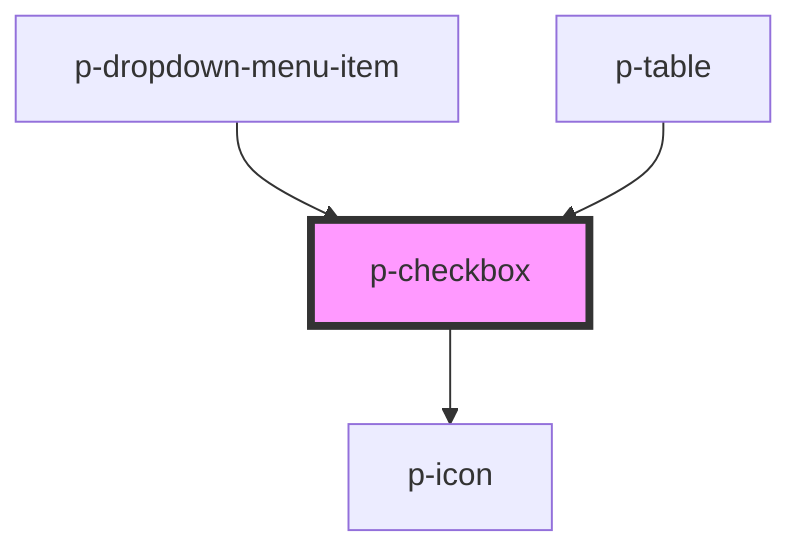

# Checkbox

## Usage:

```html
<p-checkbox />

<!-- or -->

<p-checkbox> Label </p-checkbox>
```

<!-- Auto Generated Below -->


## Properties

| Property        | Attribute       | Description                                   | Type             | Default     |
| --------------- | --------------- | --------------------------------------------- | ---------------- | ----------- |
| `checked`       | `checked`       | Wether the checkbox is checked                | `boolean`        | `undefined` |
| `disabled`      | `disabled`      | Wether the checkbox is disabled               | `boolean`        | `false`     |
| `id`            | `id`            | The id of the checkbox button                 | `string`         | `undefined` |
| `indeterminate` | `indeterminate` | Wether the checkbox is in indeterminate state | `boolean`        | `undefined` |
| `name`          | `name`          | The name of the checkbox button               | `string`         | `undefined` |
| `required`      | `required`      | Wether the checkbox is required               | `boolean`        | `true`      |
| `size`          | `size`          | The size of the checkbox                      | `"base" \| "sm"` | `'base'`    |


## Events

| Event                 | Description                              | Type                   |
| --------------------- | ---------------------------------------- | ---------------------- |
| `checkedChange`       | Event whenever the checked changes       | `CustomEvent<boolean>` |
| `indeterminateChange` | Event whenever the indeterminate changes | `CustomEvent<boolean>` |


## Dependencies

### Used by

 - [p-dropdown-menu-item](../dropdown-menu-item)
 - [p-table](../../organisms/table)

### Depends on

- [p-icon](../icon)

### Graph


----------------------------------------------

*Built with [StencilJS](https://stenciljs.com/)*
