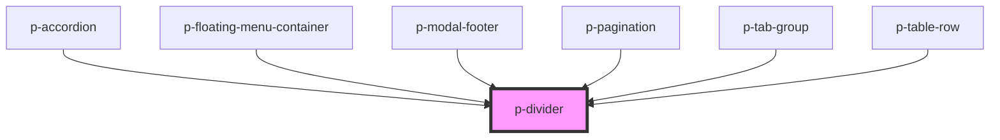

# p-divider

<!-- Auto Generated Below -->

## Properties

| Property  | Attribute | Description                   | Type                         | Default        |
| --------- | --------- | ----------------------------- | ---------------------------- | -------------- |
| `variant` | `variant` | The variant of the modal body | `"horizontal" \| "vertical"` | `'horizontal'` |

## Dependencies

### Used by

 - [p-accordion](../../deprecated/molecules/accordion)
 - [p-floating-menu-container](../floating-menu/container)
 - [p-modal-footer](../modal/footer)
 - [p-pagination](../../molecules/pagination/pagination)
 - [p-tab-group](../../deprecated/atoms/tab/group)
 - [p-table-row](../../deprecated/molecules/table/row)

### Graph

----------------------------------------------

*Built with [StencilJS](https://stenciljs.com/)*
