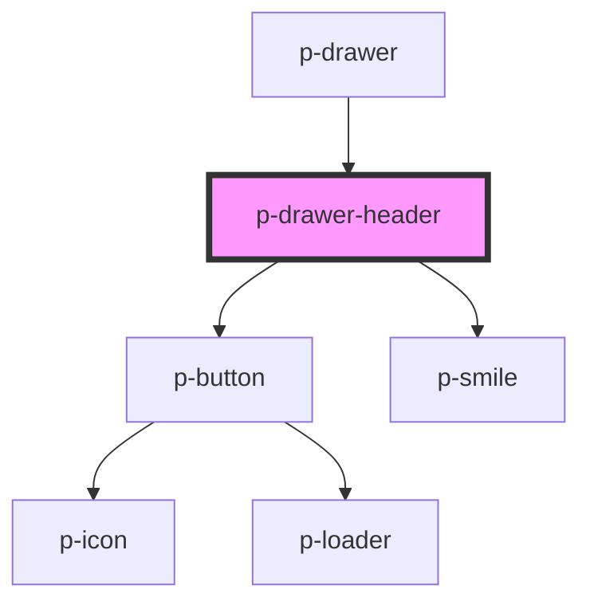

# p-drawer-header

<!-- Auto Generated Below -->

## Properties

| Property    | Attribute    | Description                               | Type      | Default |
| ----------- | ------------ | ----------------------------------------- | --------- | ------- |
| `showClose` | `show-close` | Wether to show the close button on mobile | `boolean` | `true`  |

## Events

| Event   | Description       | Type                      |
| ------- | ----------------- | ------------------------- |
| `close` | Close click event | `CustomEvent<MouseEvent>` |

## Dependencies

### Used by

 - [p-drawer](../../../organisms/drawer)

### Depends on

- [p-button](../../../molecules/button)
- [p-smile](../../smile)

### Graph

----------------------------------------------

*Built with [StencilJS](https://stenciljs.com/)*
