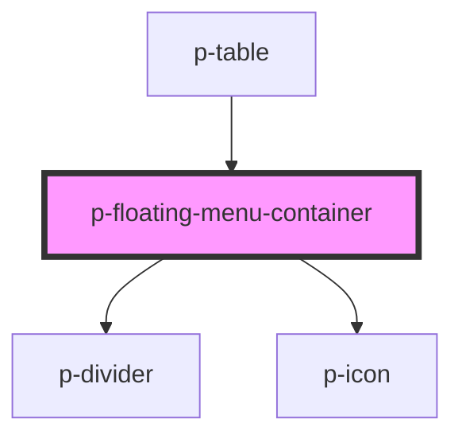

# Floating Menu Container

## Usage:

```html
<p-floating-menu-container />

<!-- or -->

<p-floating-menu-container> Content </p-floating-menu-container>
```

<!-- Auto Generated Below -->


## Properties

| Property                 | Attribute                | Description                               | Type                         | Default                                                                                                                                                                                 |
| ------------------------ | ------------------------ | ----------------------------------------- | ---------------------------- | --------------------------------------------------------------------------------------------------------------------------------------------------------------------------------------- |
| `amount`                 | `amount`                 | The amount selected                       | `number`                     | `0`                                                                                                                                                                                     |
| `amountSelectedTemplate` | --                       | The template for amount selected          | `(amount: number) => string` | `( 		amount: number 	) => 		formatTranslation( 			(amount === 1 				? this._locales.amount_selected 				: this._locales.amount_selected_plural 			)?.replace('{{amount}}', amount) 		)` |
| `enableAmountSelected`   | `enable-amount-selected` | Wether to show the amount selected        | `boolean`                    | `true`                                                                                                                                                                                  |
| `enableClose`            | `enable-close`           | Wether to enablethe close button          | `boolean`                    | `true`                                                                                                                                                                                  |
| `usedInTable`            | `used-in-table`          | Wether the container is used in the table | `boolean`                    | `false`                                                                                                                                                                                 |


## Events

| Event   | Description                                | Type                      |
| ------- | ------------------------------------------ | ------------------------- |
| `close` | Event whenever the close button is clicked | `CustomEvent<MouseEvent>` |


## Dependencies

### Used by

 - [p-table](../../organisms/table)

### Depends on

- [p-divider](../divider)
- [p-icon](../icon)

### Graph


----------------------------------------------

*Built with [StencilJS](https://stenciljs.com/)*
