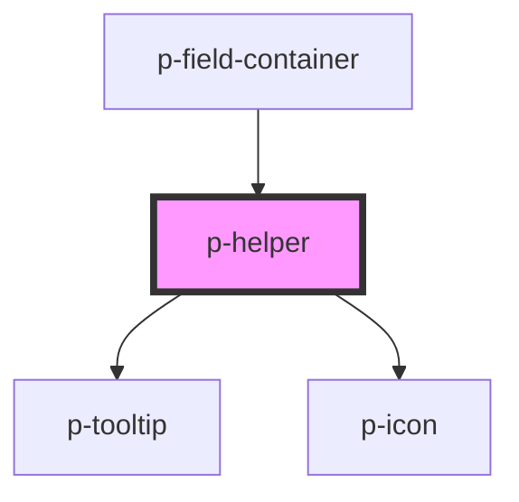

# p-helper

<!-- Auto Generated Below -->

## Properties

| Property    | Attribute   | Description                           | Type                                                                                                                                                                 | Default      |
| ----------- | ----------- | ------------------------------------- | -------------------------------------------------------------------------------------------------------------------------------------------------------------------- | ------------ |
| `placement` | `placement` | The placement of the helper popover   | `"bottom" \| "bottom-end" \| "bottom-start" \| "left" \| "left-end" \| "left-start" \| "right" \| "right-end" \| "right-start" \| "top" \| "top-end" \| "top-start"` | `'top'`      |
| `strategy`  | `strategy`  | The strategy of the popover placement | `"absolute" \| "fixed"`                                                                                                                                              | `'absolute'` |

## Dependencies

### Used by

 - [p-field-container](../../molecules/field/container)

### Depends on

- [p-tooltip](../tooltip)
- [p-icon](../icon)

### Graph

----------------------------------------------

*Built with [StencilJS](https://stenciljs.com/)*
