# p-icon

<!-- Auto Generated Below -->

## Properties

| Property               | Attribute | Description                                        | Type                                                                                                                                                                                                                                                                                                                                                                                                                                                                                                                                                                                                                                                                                                                                                                                                                                                                                                                                                                                                                                                                                                                                                                                                                                                                                                                                                                                                                                                                                                                                                                                         | Default     |
| ---------------------- | --------- | -------------------------------------------------- | -------------------------------------------------------------------------------------------------------------------------------------------------------------------------------------------------------------------------------------------------------------------------------------------------------------------------------------------------------------------------------------------------------------------------------------------------------------------------------------------------------------------------------------------------------------------------------------------------------------------------------------------------------------------------------------------------------------------------------------------------------------------------------------------------------------------------------------------------------------------------------------------------------------------------------------------------------------------------------------------------------------------------------------------------------------------------------------------------------------------------------------------------------------------------------------------------------------------------------------------------------------------------------------------------------------------------------------------------------------------------------------------------------------------------------------------------------------------------------------------------------------------------------------------------------------------------------------------- | ----------- |
| `flip`                 | `flip`    | Wether to flip the icon horizontally or vertically | `"horizontal" \| "none" \| "vertical"`                                                                                                                                                                                                                                                                                                                                                                                                                                                                                                                                                                                                                                                                                                                                                                                                                                                                                                                                                                                                                                                                                                                                                                                                                                                                                                                                                                                                                                                                                                                                                       | `'none'`    |
| `rotate`               | `rotate`  | Wether to rotate the icon x degrees                | `number`                                                                                                                                                                                                                                                                                                                                                                                                                                                                                                                                                                                                                                                                                                                                                                                                                                                                                                                                                                                                                                                                                                                                                                                                                                                                                                                                                                                                                                                                                                                                                                                     | `0`         |
| `size`                 | `size`    | The size of the icon, using tailwind sizes         | `"2xl" \| "3xl" \| "4xl" \| "auto" \| "base" \| "lg" \| "sm" \| "xl" \| "xs" \| "xxs"`                                                                                                                                                                                                                                                                                                                                                                                                                                                                                                                                                                                                                                                                                                                                                                                                                                                                                                                                                                                                                                                                                                                                                                                                                                                                                                                                                                                                                                                                                                       | `'base'`    |
| `variant` _(required)_ | `variant` | The icon the be displayed                          | `"address-book" \| "alarm" \| "apple" \| "arrow" \| "attachment" \| "bank" \| "bell" \| "bread" \| "cake" \| "calculator" \| "calendar" \| "calendar-free" \| "calendar-multi" \| "calendar-not-free" \| "camera" \| "car" \| "caret" \| "certified" \| "chair" \| "chat" \| "check-circle" \| "checkmark" \| "checkmarkThick" \| "city" \| "clock" \| "companies" \| "company" \| "copy" \| "credit-card" \| "cross-circle" \| "cutlery" \| "department" \| "description" \| "diamond" \| "docter" \| "document" \| "double-arrow" \| "double-caret" \| "download" \| "enter-key" \| "envelope" \| "error-circle" \| "euro" \| "exam" \| "eye" \| "eye-closed" \| "female" \| "file-export" \| "file-import" \| "filter" \| "flag" \| "flower" \| "folder" \| "globe" \| "globe-2" \| "google" \| "hash" \| "hat" \| "headset" \| "home" \| "id" \| "id-two" \| "ideal" \| "info-circle" \| "integration" \| "key" \| "language" \| "laptop" \| "location" \| "lock" \| "mail" \| "male" \| "medal" \| "menu" \| "menu-arrow" \| "minus" \| "moon" \| "more" \| "negative" \| "other" \| "pay" \| "pdf" \| "pencil" \| "percent" \| "phone" \| "pie-chart" \| "piggy-bank" \| "placeholder" \| "plus" \| "power" \| "question-circle" \| "receipt" \| "reset" \| "running" \| "search" \| "send" \| "settings" \| "shuffle" \| "sick" \| "signature" \| "sparkle" \| "spinner" \| "spinning" \| "star" \| "stroller" \| "tag" \| "tasks" \| "tools" \| "tooth" \| "train" \| "trash" \| "turn" \| "unlocked" \| "upload" \| "user" \| "users" \| "warning" \| "wave" \| "xls" \| "zipcode"` | `undefined` |

## Dependencies

### Used by

 - [p-accordion](../../molecules/accordion)
 - [p-attachment](../../molecules/attachment)
 - [p-button](../../molecules/button)
 - [p-card-header](../card/header)
 - [p-checkbox](../checkbox)
 - [p-dropdown-menu-item](../dropdown-menu/item)
 - [p-field](../../molecules/field/field)
 - [p-floating-menu-item](../floating-menu/item)
 - [p-helper](../helper)
 - [p-info-panel](../info-panel)
 - [p-label](../../molecules/label)
 - [p-listing-item](../listing/item)
 - [p-navigation-item](../../molecules/navigation/item)
 - [p-pagination-pages](../../molecules/pagination/pages)
 - [p-pagination-size](../../molecules/pagination/size)
 - [p-range](../../molecules/range)
 - [p-segment-item](../segment/item)
 - [p-select](../../molecules/select)
 - [p-toast](../../molecules/toast)

### Graph

```mermaid
graph TD;
  p-accordion --> p-icon
  p-attachment --> p-icon
  p-button --> p-icon
  p-card-header --> p-icon
  p-checkbox --> p-icon
  p-dropdown-menu-item --> p-icon
  p-field --> p-icon
  p-floating-menu-item --> p-icon
  p-helper --> p-icon
  p-info-panel --> p-icon
  p-label --> p-icon
  p-listing-item --> p-icon
  p-navigation-item --> p-icon
  p-pagination-pages --> p-icon
  p-pagination-size --> p-icon
  p-range --> p-icon
  p-segment-item --> p-icon
  p-select --> p-icon
  p-toast --> p-icon
  style p-icon fill:#f9f,stroke:#333,stroke-width:4px
```

----------------------------------------------

*Built with [StencilJS](https://stenciljs.com/)*
