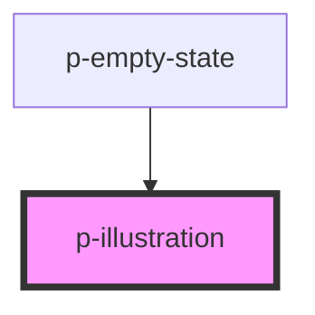

# p-illustration

<!-- Auto Generated Below -->

## Properties

| Property               | Attribute | Description               | Type                                                                                                                                                                                        | Default     |
| ---------------------- | --------- | ------------------------- | ------------------------------------------------------------------------------------------------------------------------------------------------------------------------------------------- | ----------- |
| `variant` _(required)_ | `variant` | The icon the be displayed | `"calculator" \| "calendar" \| "clock" \| "coins" \| "file" \| "file-invoice" \| "file-notes" \| "folder" \| "payment" \| "search" \| "sick-leave" \| "table" \| "tag" \| "task" \| "user"` | `undefined` |

## Dependencies

### Used by

 - [p-empty-state](../../molecules/empty-state)

### Graph

----------------------------------------------

*Built with [StencilJS](https://stenciljs.com/)*
