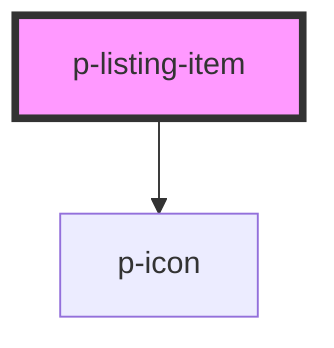

# p-listing-item

<!-- Auto Generated Below -->

## Properties

| Property | Attribute | Description          | Type                                                                                                                                                                                                                                                                                                                                                                                                                                                                                                                                                                                                                                                                                                                                                                                                                                                                                                                                                                                                                                                                                                                                                                                                                                                                                                                                                                                                                                                                                                                                                                                         | Default         |
| -------- | --------- | -------------------- | -------------------------------------------------------------------------------------------------------------------------------------------------------------------------------------------------------------------------------------------------------------------------------------------------------------------------------------------------------------------------------------------------------------------------------------------------------------------------------------------------------------------------------------------------------------------------------------------------------------------------------------------------------------------------------------------------------------------------------------------------------------------------------------------------------------------------------------------------------------------------------------------------------------------------------------------------------------------------------------------------------------------------------------------------------------------------------------------------------------------------------------------------------------------------------------------------------------------------------------------------------------------------------------------------------------------------------------------------------------------------------------------------------------------------------------------------------------------------------------------------------------------------------------------------------------------------------------------- | --------------- |
| `icon`   | `icon`    | The icon of the step | `"address-book" \| "alarm" \| "apple" \| "arrow" \| "attachment" \| "bank" \| "bell" \| "bread" \| "cake" \| "calculator" \| "calendar" \| "calendar-free" \| "calendar-multi" \| "calendar-not-free" \| "camera" \| "car" \| "caret" \| "certified" \| "chair" \| "chat" \| "check-circle" \| "checkmark" \| "checkmarkThick" \| "city" \| "clock" \| "companies" \| "company" \| "copy" \| "credit-card" \| "cross-circle" \| "cutlery" \| "department" \| "description" \| "diamond" \| "docter" \| "document" \| "double-arrow" \| "double-caret" \| "download" \| "enter-key" \| "envelope" \| "error-circle" \| "euro" \| "exam" \| "eye" \| "eye-closed" \| "female" \| "file-export" \| "file-import" \| "filter" \| "flag" \| "flower" \| "folder" \| "globe" \| "globe-2" \| "google" \| "hash" \| "hat" \| "headset" \| "home" \| "id" \| "id-two" \| "ideal" \| "info-circle" \| "integration" \| "key" \| "language" \| "laptop" \| "location" \| "lock" \| "mail" \| "male" \| "medal" \| "menu" \| "menu-arrow" \| "minus" \| "moon" \| "more" \| "negative" \| "other" \| "pay" \| "pdf" \| "pencil" \| "percent" \| "phone" \| "pie-chart" \| "piggy-bank" \| "placeholder" \| "plus" \| "power" \| "question-circle" \| "receipt" \| "reset" \| "running" \| "search" \| "send" \| "settings" \| "shuffle" \| "sick" \| "signature" \| "sparkle" \| "spinner" \| "spinning" \| "star" \| "stroller" \| "tag" \| "tasks" \| "tools" \| "tooth" \| "train" \| "trash" \| "turn" \| "unlocked" \| "upload" \| "user" \| "users" \| "warning" \| "wave" \| "xls" \| "zipcode"` | `'placeholder'` |

## Dependencies

### Depends on

- [p-icon](../../icon)

### Graph

----------------------------------------------

*Built with [StencilJS](https://stenciljs.com/)*
