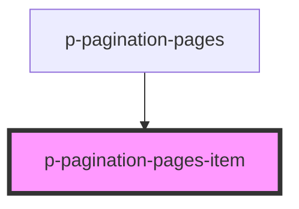

# p-pagination-pages-item

<!-- Auto Generated Below -->

## Properties

| Property   | Attribute  | Description                            | Type                      | Default     |
| ---------- | ---------- | -------------------------------------- | ------------------------- | ----------- |
| `active`   | `active`   | Wether the pagination item is active   | `boolean`                 | `false`     |
| `disabled` | `disabled` | Wether the pagination item is disabled | `boolean`                 | `false`     |
| `hover`    | `hover`    | Wether the pagination item has hover   | `boolean`                 | `true`      |
| `variant`  | `variant`  | The variant of the item                | `"carousel" \| "default"` | `'default'` |

## Dependencies

### Used by

 - [p-pagination-pages](../../molecules/pagination-pages)

### Graph

----------------------------------------------

*Built with [StencilJS](https://stenciljs.com/)*
