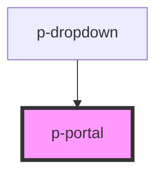

# Portal

## Usage:

```html
<p-portal> Content to move </p-portal>
```

<!-- Auto Generated Below -->


## Properties

| Property         | Attribute         | Description | Type     | Default     |
| ---------------- | ----------------- | ----------- | -------- | ----------- |
| `containerClass` | `container-class` |             | `string` | `undefined` |


## Dependencies

### Used by

 - [p-dropdown](../../molecules/dropdown)

### Graph


----------------------------------------------

*Built with [StencilJS](https://stenciljs.com/)*
