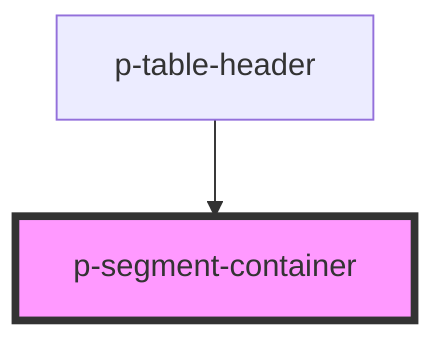

# p-segment-container

<!-- Auto Generated Below -->

## Dependencies

### Used by

 - [p-table-header](../../../molecules/table/header)

### Graph

----------------------------------------------

*Built with [StencilJS](https://stenciljs.com/)*
