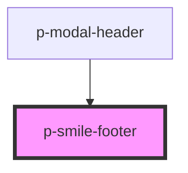

# p-divider

<!-- Auto Generated Below -->

## Dependencies

### Used by

 - [p-modal-header](../modal/header)

### Graph

----------------------------------------------

*Built with [StencilJS](https://stenciljs.com/)*
