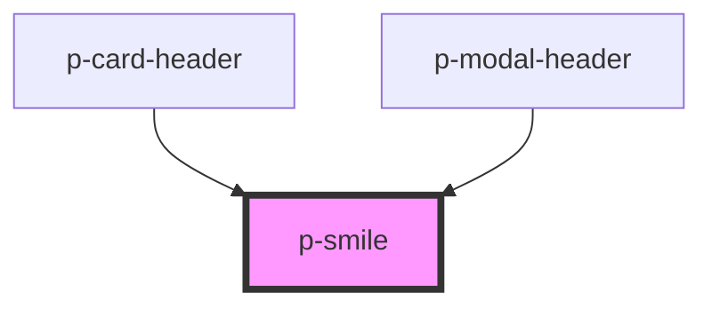

# p-divider

<!-- Auto Generated Below -->

## Properties

| Property  | Attribute | Description                     | Type                | Default   |
| --------- | --------- | ------------------------------- | ------------------- | --------- |
| `variant` | `variant` | The variant of the smile footer | `"card" \| "modal"` | `'modal'` |

## Dependencies

### Used by

 - [p-card-header](../card/header)
 - [p-modal-header](../modal/header)

### Graph

----------------------------------------------

*Built with [StencilJS](https://stenciljs.com/)*
