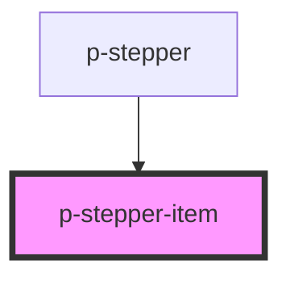

# p-stepper-item

<!-- Auto Generated Below -->

## Properties

| Property          | Attribute          | Description                                                | Type                           | Default    |
| ----------------- | ------------------ | ---------------------------------------------------------- | ------------------------------ | ---------- |
| `active`          | `active`           | Wether the step is active                                  | `boolean`                      | `false`    |
| `align`           | `align`            | The alignment of the content in case of vertical direction | `"center" \| "end" \| "start"` | `'center'` |
| `contentPosition` | `content-position` | The position of the content in case of vertical direction  | `"end" \| "start"`             | `'end'`    |
| `finished`        | `finished`         | Wether the step is finished                                | `boolean`                      | `false`    |
| `number`          | `number`           | The number of the step                                     | `number`                       | `1`        |

## Dependencies

### Used by

 - [p-stepper](../../../organisms/stepper)

### Graph

----------------------------------------------

*Built with [StencilJS](https://stenciljs.com/)*
