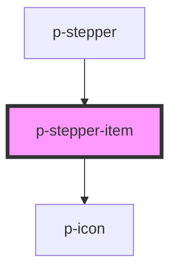

# p-stepper-item

<!-- Auto Generated Below -->

## Properties

| Property          | Attribute          | Description                                                | Type                                                                                                                                                                                                                                                                                                                                                                                                                                                                                                                                                                                                                                                                                                                                                                                                                                                                                                                                                                                                                                                                                                                                                                                                                                                                                                                                                                                                                                                                                                                                                                                                                                                                             | Default        |
| ----------------- | ------------------ | ---------------------------------------------------------- | -------------------------------------------------------------------------------------------------------------------------------------------------------------------------------------------------------------------------------------------------------------------------------------------------------------------------------------------------------------------------------------------------------------------------------------------------------------------------------------------------------------------------------------------------------------------------------------------------------------------------------------------------------------------------------------------------------------------------------------------------------------------------------------------------------------------------------------------------------------------------------------------------------------------------------------------------------------------------------------------------------------------------------------------------------------------------------------------------------------------------------------------------------------------------------------------------------------------------------------------------------------------------------------------------------------------------------------------------------------------------------------------------------------------------------------------------------------------------------------------------------------------------------------------------------------------------------------------------------------------------------------------------------------------------------- | -------------- |
| `active`          | `active`           | Wether the step is active                                  | `boolean`                                                                                                                                                                                                                                                                                                                                                                                                                                                                                                                                                                                                                                                                                                                                                                                                                                                                                                                                                                                                                                                                                                                                                                                                                                                                                                                                                                                                                                                                                                                                                                                                                                                                        | `false`        |
| `align`           | `align`            | The alignment of the content in case of vertical direction | `"center" \| "end" \| "start"`                                                                                                                                                                                                                                                                                                                                                                                                                                                                                                                                                                                                                                                                                                                                                                                                                                                                                                                                                                                                                                                                                                                                                                                                                                                                                                                                                                                                                                                                                                                                                                                                                                                   | `'center'`     |
| `contentPosition` | `content-position` | The position of the content in case of vertical direction  | `"end" \| "start"`                                                                                                                                                                                                                                                                                                                                                                                                                                                                                                                                                                                                                                                                                                                                                                                                                                                                                                                                                                                                                                                                                                                                                                                                                                                                                                                                                                                                                                                                                                                                                                                                                                                               | `'end'`        |
| `direction`       | `direction`        | The direction of the item                                  | `"horizontal" \| "vertical"`                                                                                                                                                                                                                                                                                                                                                                                                                                                                                                                                                                                                                                                                                                                                                                                                                                                                                                                                                                                                                                                                                                                                                                                                                                                                                                                                                                                                                                                                                                                                                                                                                                                     | `'horizontal'` |
| `finished`        | `finished`         | Wether the step is finished                                | `boolean`                                                                                                                                                                                                                                                                                                                                                                                                                                                                                                                                                                                                                                                                                                                                                                                                                                                                                                                                                                                                                                                                                                                                                                                                                                                                                                                                                                                                                                                                                                                                                                                                                                                                        | `false`        |
| `icon`            | `icon`             | Icon to show instead of the number                         | `"address-book" \| "alarm" \| "apple" \| "arrow" \| "attachment" \| "bank" \| "bell" \| "bread" \| "cake" \| "calculator" \| "calendar" \| "calendar-free" \| "calendar-multi" \| "calendar-not-free" \| "camera" \| "car" \| "caret" \| "certified" \| "chair" \| "chat" \| "check-circle" \| "checkmark" \| "checkmarkThick" \| "city" \| "clock" \| "companies" \| "company" \| "component" \| "copy" \| "credit-card" \| "cross-circle" \| "cutlery" \| "department" \| "description" \| "diamond" \| "docter" \| "document" \| "double-arrow" \| "double-caret" \| "download" \| "enter-key" \| "envelope" \| "error-circle" \| "euro" \| "exam" \| "eye" \| "eye-closed" \| "female" \| "file-export" \| "file-import" \| "filter" \| "flag" \| "flower" \| "folder" \| "globe" \| "globe-2" \| "google" \| "hash" \| "hat" \| "headset" \| "history" \| "home" \| "id" \| "id-two" \| "ideal" \| "info-circle" \| "integration" \| "key" \| "lamp" \| "language" \| "laptop" \| "location" \| "lock" \| "mail" \| "male" \| "math" \| "medal" \| "menu" \| "menu-arrow" \| "minus" \| "moon" \| "more" \| "negative" \| "new-tab" \| "other" \| "pay" \| "pdf" \| "pencil" \| "percent" \| "phone" \| "pie-chart" \| "piggy-bank" \| "placeholder" \| "plus" \| "power" \| "question-circle" \| "receipt" \| "reset" \| "running" \| "scroll" \| "search" \| "send" \| "settings" \| "shuffle" \| "sick" \| "signature" \| "sparkle" \| "spinner" \| "spinning" \| "stack" \| "star" \| "stroller" \| "tag" \| "tasks" \| "tools" \| "tooth" \| "train" \| "trash" \| "turn" \| "unlocked" \| "upload" \| "user" \| "users" \| "warning" \| "wave" \| "xls" \| "zipcode"` | `undefined`    |
| `number`          | `number`           | The number of the step                                     | `number`                                                                                                                                                                                                                                                                                                                                                                                                                                                                                                                                                                                                                                                                                                                                                                                                                                                                                                                                                                                                                                                                                                                                                                                                                                                                                                                                                                                                                                                                                                                                                                                                                                                                         | `1`            |
| `variant`         | `variant`          | The variant of the item                                    | `"default" \| "icon"`                                                                                                                                                                                                                                                                                                                                                                                                                                                                                                                                                                                                                                                                                                                                                                                                                                                                                                                                                                                                                                                                                                                                                                                                                                                                                                                                                                                                                                                                                                                                                                                                                                                            | `'default'`    |

## Dependencies

### Used by

 - [p-stepper](../../../organisms/stepper)

### Depends on

- [p-icon](../../icon)

### Graph

```mermaid
graph TD;
  p-stepper-item --> p-icon
  p-stepper --> p-stepper-item
  style p-stepper-item fill:#f9f,stroke:#333,stroke-width:4px
```

----------------------------------------------

*Built with [StencilJS](https://stenciljs.com/)*
