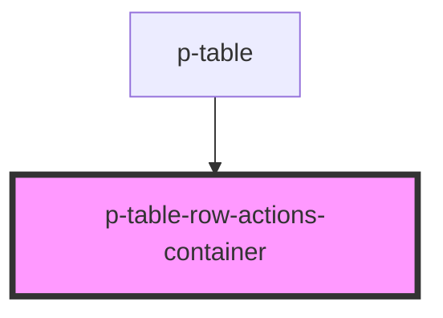

# p-table-container

<!-- Auto Generated Below -->

## Properties

| Property  | Attribute | Description               | Type      | Default |
| --------- | --------- | ------------------------- | --------- | ------- |
| `checked` | `checked` | Wether the row is checked | `boolean` | `false` |

## Dependencies

### Used by

 - [p-table](../../../organisms/table)

### Graph

----------------------------------------------

*Built with [StencilJS](https://stenciljs.com/)*
