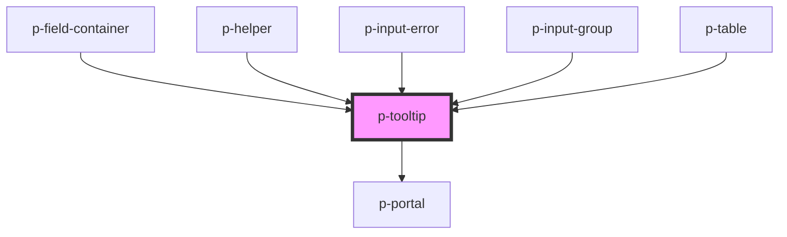

# p-tooltip

<!-- Auto Generated Below -->

## Properties

| Property           | Attribute            | Description                                      | Type                                                                                                                                                                 | Default      |
| ------------------ | -------------------- | ------------------------------------------------ | -------------------------------------------------------------------------------------------------------------------------------------------------------------------- | ------------ |
| `canManuallyClose` | `can-manually-close` | Wether to someone can manually close the popover | `boolean`                                                                                                                                                            | `true`       |
| `content`          | `content`            | The content of the popover                       | `any`                                                                                                                                                                | `null`       |
| `enableUserInput`  | `enable-user-input`  | Wether the tooltip can be shown by user input    | `boolean`                                                                                                                                                            | `true`       |
| `offset`           | `offset`             | The offset of the popover                        | `number`                                                                                                                                                             | `8`          |
| `placement`        | `placement`          | The placement of the popover                     | `"bottom" \| "bottom-end" \| "bottom-start" \| "left" \| "left-end" \| "left-start" \| "right" \| "right-end" \| "right-start" \| "top" \| "top-end" \| "top-start"` | `undefined`  |
| `show`             | `show`               | Wether to show the popover                       | `boolean`                                                                                                                                                            | `false`      |
| `strategy`         | `strategy`           | The strategy of the popover placement            | `"absolute" \| "fixed"`                                                                                                                                              | `'absolute'` |
| `usePortal`        | `use-portal`         | Wether to use a portal for the tooltip           | `boolean`                                                                                                                                                            | `false`      |
| `variant`          | `variant`            | The variant of the popover                       | `"click" \| "error" \| "hover"`                                                                                                                                      | `'hover'`    |

## Events

| Event    | Description       | Type                   |
| -------- | ----------------- | ---------------------- |
| `isOpen` | Open change event | `CustomEvent<boolean>` |

## Dependencies

### Used by

 - [p-field-container](../../molecules/field/container)
 - [p-helper](../helper)
 - [p-input-error](../../deprecated/molecules/input/error)
 - [p-input-group](../../deprecated/molecules/input/group)
 - [p-table](../../organisms/table)

### Depends on

- [p-portal](../../helpers/portal)

### Graph

----------------------------------------------

*Built with [StencilJS](https://stenciljs.com/)*
