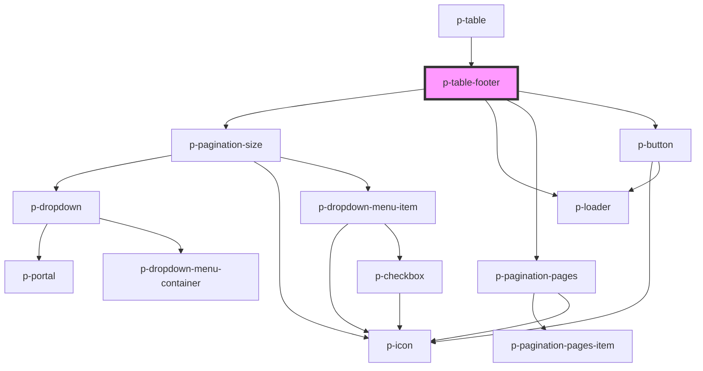

# p-table-footer

<!-- Auto Generated Below -->

## Properties

| Property             | Attribute             | Description                                        | Type       | Default              |
| -------------------- | --------------------- | -------------------------------------------------- | ---------- | -------------------- |
| `enableExport`       | `enable-export`       | Wether to enable export                            | `boolean`  | `true`               |
| `enablePageSize`     | `enable-page-size`    | Wether to enable page size select                  | `boolean`  | `true`               |
| `enablePagination`   | `enable-pagination`   | Wether to enable pagination                        | `boolean`  | `true`               |
| `hideOnSinglePage`   | `hide-on-single-page` | Wether to hide when there is only 1 page available | `boolean`  | `true`               |
| `loading`            | `loading`             | Wether we want to show loading state               | `boolean`  | `false`              |
| `page`               | `page`                | The current page                                   | `number`   | `1`                  |
| `pageSize`           | `page-size`           | The amount of items per page                       | `number`   | `defaultSize`        |
| `pageSizeOptions`    | `page-size-options`   | The options for the page size                      | `number[]` | `defaultSizeOptions` |
| `total` _(required)_ | `total`               | The total amount of items                          | `number`   | `undefined`          |

## Events

| Event            | Description                     | Type                  |
| ---------------- | ------------------------------- | --------------------- |
| `export`         | Event whenever the page changes | `CustomEvent<number>` |
| `pageChange`     | Event whenever the page changes | `CustomEvent<number>` |
| `pageSizeChange` | Event whenever the page changes | `CustomEvent<number>` |

## Dependencies

### Used by

 - [p-table](../../../organisms/table)

### Depends on

- [p-pagination-size](../../../../molecules/pagination/size)
- [p-loader](../../../atoms/loader)
- [p-pagination-pages](../../../../molecules/pagination/pages)
- [p-button](../../../../molecules/button)

### Graph

----------------------------------------------

*Built with [StencilJS](https://stenciljs.com/)*
