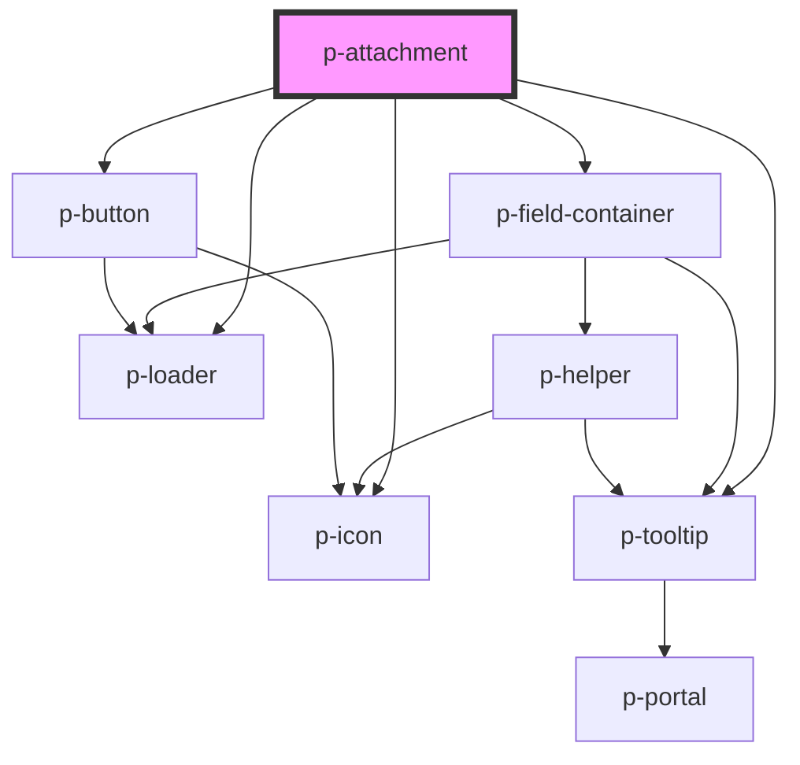

# p-attachment

<!-- Auto Generated Below -->

## Properties

| Property               | Attribute                 | Description                                         | Type                        | Default              |
| ---------------------- | ------------------------- | --------------------------------------------------- | --------------------------- | -------------------- |
| `accept`               | `accept`                  | The type of files to accept                         | `string \| string[]`        | `null`               |
| `cameraTooltip`        | `camera-tooltip`          | The text for the camera tooltip                     | `string`                    | `'Camera'`           |
| `deleteTooltip`        | `delete-tooltip`          | The text for the delete tooltip                     | `string`                    | `'Delete'`           |
| `downloadTooltip`      | `download-tooltip`        | The text for the download tooltip                   | `string`                    | `'Download'`         |
| `enableCameraOnMobile` | `enable-camera-on-mobile` | Wether to enable the camera button on mobile        | `boolean`                   | `false`              |
| `error`                | `error`                   | The error to show                                   | `string`                    | `undefined`          |
| `fileId`               | `file-id`                 | The fileID to use to track the file                 | `string`                    | `undefined`          |
| `helper`               | `helper`                  | The helper of the attachment                        | `HTMLSlotElement \| string` | `undefined`          |
| `label`                | `label`                   | The label of the attachment                         | `HTMLSlotElement \| string` | `undefined`          |
| `loading`              | `loading`                 | Wether the attachment is loading                    | `boolean`                   | `false`              |
| `mode`                 | `mode`                    | The variant of the attachment                       | `"read" \| "write"`         | `'read'`             |
| `placeholder`          | `placeholder`             | The placeholder of the attachment                   | `string`                    | `'Upload a file...'` |
| `required`             | `required`                | Wether the attachment is required                   | `boolean`                   | `true`               |
| `uploadTooltip`        | `upload-tooltip`          | The text for the upload tooltip                     | `string`                    | `'Upload'`           |
| `value`                | `value`                   | The value of the attachment (usually the file name) | `string`                    | `undefined`          |

## Events

| Event      | Description                    | Type                                                           |
| ---------- | ------------------------------ | -------------------------------------------------------------- |
| `delete`   | Event when delete is pressed   | `CustomEvent<void>`                                            |
| `download` | Event when download is pressed | `CustomEvent<void>`                                            |
| `upload`   | Event when upload is pressed   | `CustomEvent<{ file: File; fileId: string; result: string; }>` |

## Dependencies

### Depends on

- [p-icon](../../atoms/icon)
- [p-loader](../../atoms/loader)
- [p-field-container](../field/container)
- [p-tooltip](../../atoms/tooltip)
- [p-button](../button)

### Graph

----------------------------------------------

*Built with [StencilJS](https://stenciljs.com/)*
