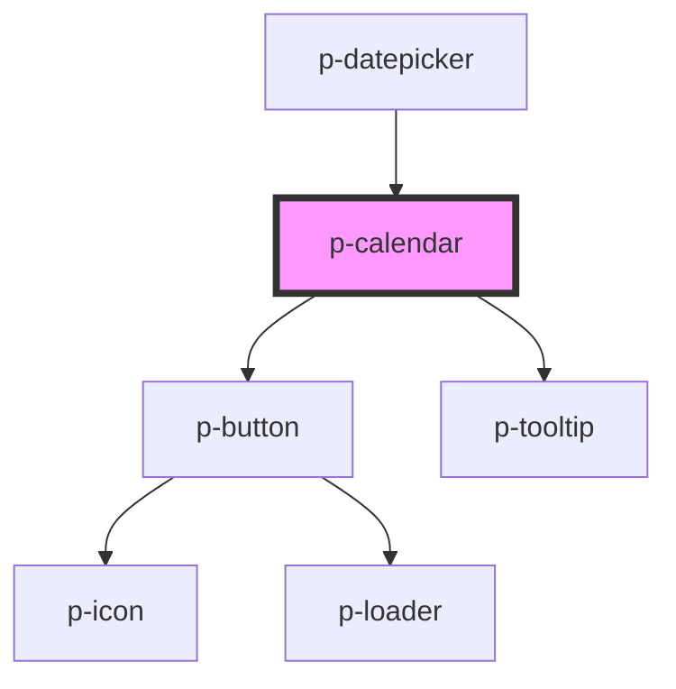

# p-calendar

<!-- Auto Generated Below -->

## Properties

| Property          | Attribute          | Description                              | Type                           | Default                   |
| ----------------- | ------------------ | ---------------------------------------- | ------------------------------ | ------------------------- |
| `disableWeekends` | `disable-weekends` | Wether to disable the weekends           | `boolean`                      | `false`                   |
| `disabledDates`   | `disabled-dates`   | Disabled dates                           | `(string \| Date)[] \| string` | `undefined`               |
| `enableToday`     | `enable-today`     | Wether to enable the today button        | `boolean`                      | `true`                    |
| `maxDate`         | `max-date`         | Max date                                 | `Date \| string`               | `this._getAutomaticMax()` |
| `minDate`         | `min-date`         | Min date                                 | `Date \| string`               | `new Date(1970, 0, 1)`    |
| `mode`            | `mode`             | The mode of the datepicker               | `"day" \| "month" \| "year"`   | `'day'`                   |
| `preselectToday`  | `preselect-today`  | Wether to automatically preselect today  | `boolean`                      | `false`                   |
| `todayText`       | `today-text`       | The text to display on the today tooltip | `string`                       | `'today'`                 |
| `value`           | `value`            | The current value                        | `Date \| string`               | `undefined`               |
| `variant`         | `variant`          | The variant of the button                | `"default" \| "embedded"`      | `'default'`               |

## Events

| Event         | Description                  | Type               |
| ------------- | ---------------------------- | ------------------ |
| `valueChange` | Event when the value changes | `CustomEvent<any>` |

## Dependencies

### Used by

 - [p-datepicker](../datepicker)

### Depends on

- [p-button](../button)
- [p-tooltip](../../atoms/tooltip)

### Graph

----------------------------------------------

*Built with [StencilJS](https://stenciljs.com/)*
