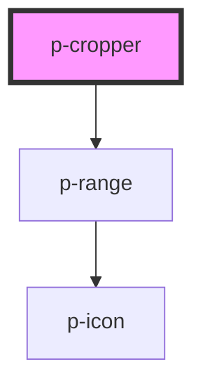

# p-cropper

<!-- Auto Generated Below -->

## Properties

| Property     | Attribute     | Description                       | Type                   | Default     |
| ------------ | ------------- | --------------------------------- | ---------------------- | ----------- |
| `returnType` | `return-type` | The return type of the onchange   | `"base64" \| "canvas"` | `'base64'`  |
| `value`      | `value`       | The image to crop (url or base64) | `string`               | `undefined` |

## Events

| Event         | Description                  | Type               |
| ------------- | ---------------------------- | ------------------ |
| `valueChange` | Event when the value changes | `CustomEvent<any>` |

## Dependencies

### Depends on

- [p-range](../range)

### Graph

----------------------------------------------

*Built with [StencilJS](https://stenciljs.com/)*
