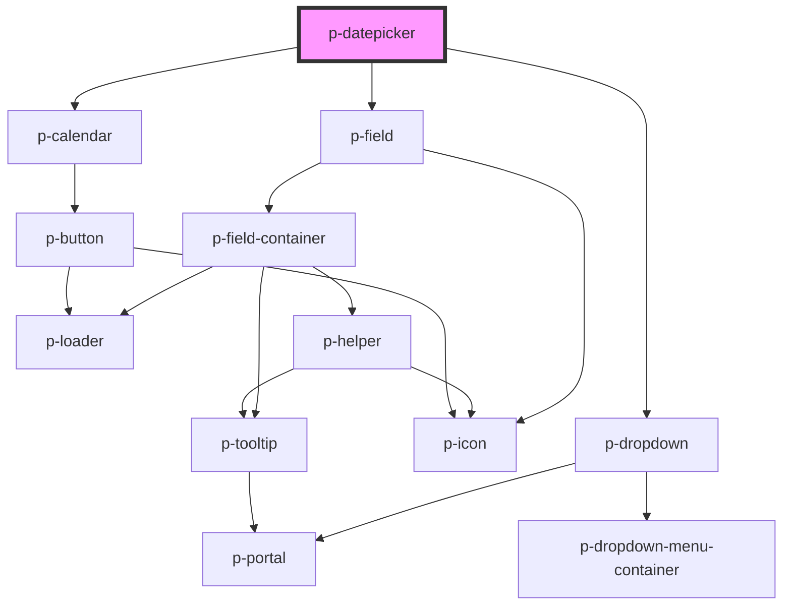

# p-datepicker

<!-- Auto Generated Below -->

## Properties

| Property             | Attribute               | Description                                               | Type                                                                                                                                                                 | Default          |
| -------------------- | ----------------------- | --------------------------------------------------------- | -------------------------------------------------------------------------------------------------------------------------------------------------------------------- | ---------------- |
| `disableWeekends`    | `disable-weekends`      | Wether to disable the weekends                            | `boolean`                                                                                                                                                            | `false`          |
| `disabled`           | `disabled`              | Wether the input group is disabled used by the datepicker | `boolean`                                                                                                                                                            | `false`          |
| `disabledDates`      | `disabled-dates`        | Disabled dates                                            | `(string \| Date)[] \| string`                                                                                                                                       | `undefined`      |
| `enableNativePicker` | `enable-native-picker`  | Enable native picker for mobile devices                   | `boolean`                                                                                                                                                            | `true`           |
| `error`              | `error`                 | The helper of the input group used by the datepicker      | `string`                                                                                                                                                             | `undefined`      |
| `format`             | `format`                | The display & parse format to use                         | `string`                                                                                                                                                             | `'dd-MM-yyyy'`   |
| `helper`             | `helper`                | The helper of the input group used by the datepicker      | `string`                                                                                                                                                             | `undefined`      |
| `hideIconWhenFilled` | `hide-icon-when-filled` | Hides the icon when filled                                | `boolean`                                                                                                                                                            | `false`          |
| `label`              | `label`                 | The label of the input group used by the datepicker       | `string`                                                                                                                                                             | `undefined`      |
| `loading`            | `loading`               | Wether the field is loading                               | `boolean`                                                                                                                                                            | `false`          |
| `maxDate`            | `max-date`              | Max date                                                  | `Date \| string`                                                                                                                                                     | `undefined`      |
| `minDate`            | `min-date`              | Min date                                                  | `Date \| string`                                                                                                                                                     | `undefined`      |
| `mode`               | `mode`                  | The mode of the datepicker                                | `"day" \| "month" \| "year"`                                                                                                                                         | `'day'`          |
| `placeholder`        | `placeholder`           | The placeholder of the input                              | `string`                                                                                                                                                             | `undefined`      |
| `placement`          | `placement`             | The placement of the dropdown                             | `"bottom" \| "bottom-end" \| "bottom-start" \| "left" \| "left-end" \| "left-start" \| "right" \| "right-end" \| "right-start" \| "top" \| "top-end" \| "top-start"` | `'bottom-start'` |
| `prefix`             | `prefix`                | The prefix of the input group used by the datepicker      | `string`                                                                                                                                                             | `undefined`      |
| `preselectToday`     | `preselect-today`       | Wethter to automatically preselect today                  | `boolean`                                                                                                                                                            | `false`          |
| `required`           | `required`              | Wether the field is required                              | `boolean`                                                                                                                                                            | `undefined`      |
| `size`               | `size`                  | The size of the input group used by the datepicker        | `"base" \| "sm"`                                                                                                                                                     | `'base'`         |
| `strategy`           | `strategy`              | The strategy of the dropdown placement                    | `"absolute" \| "fixed"`                                                                                                                                              | `'absolute'`     |
| `value`              | `value`                 | The current value                                         | `Date \| string`                                                                                                                                                     | `undefined`      |

## Events

| Event         | Description                  | Type               |
| ------------- | ---------------------------- | ------------------ |
| `valueChange` | Event when the value changes | `CustomEvent<any>` |

## Dependencies

### Depends on

- [p-dropdown](../dropdown)
- [p-field](../field/field)
- [p-calendar](../calendar)

### Graph

----------------------------------------------

*Built with [StencilJS](https://stenciljs.com/)*
