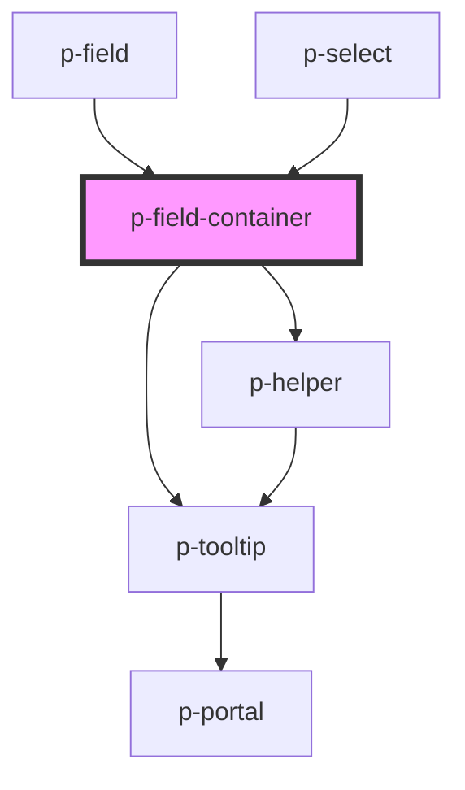

# Field Container

## Usage:

```html
<p-field-container [label]="Label"> Content </p-divider>
```

<!-- Auto Generated Below -->


## Properties

| Property           | Attribute            | Description                        | Type                                                                                                                                                                 | Default                         |
| ------------------ | -------------------- | ---------------------------------- | -------------------------------------------------------------------------------------------------------------------------------------------------------------------- | ------------------------------- |
| `error`            | `error`              | The helper of the input group      | `HTMLSlotElement \| string`                                                                                                                                          | `undefined`                     |
| `errorPlacement`   | `error-placement`    | The placement of the error popover | `"bottom" \| "bottom-end" \| "bottom-start" \| "left" \| "left-end" \| "left-start" \| "right" \| "right-end" \| "right-start" \| "top" \| "top-end" \| "top-start"` | `undefined`                     |
| `forceShowTooltip` | `force-show-tooltip` | Force show the error tooltip       | `boolean`                                                                                                                                                            | `false`                         |
| `helper`           | `helper`             | The helper of the input group      | `HTMLSlotElement \| string`                                                                                                                                          | `undefined`                     |
| `label`            | `label`              | The label of the input group       | `HTMLSlotElement \| string`                                                                                                                                          | `undefined`                     |
| `optionalTemplate` | --                   | The template for the optional text | `() => string`                                                                                                                                                       | `this._defaultOptionalTemplate` |
| `required`         | `required`           | Wether the field is required       | `boolean`                                                                                                                                                            | `undefined`                     |


## Events

| Event   | Description | Type                |
| ------- | ----------- | ------------------- |
| `focus` |             | `CustomEvent<void>` |


## Dependencies

### Used by

 - [p-field](../field)
 - [p-select](../select)

### Depends on

- [p-helper](../../atoms/helper)
- [p-tooltip](../../atoms/tooltip)

### Graph


----------------------------------------------

*Built with [StencilJS](https://stenciljs.com/)*
