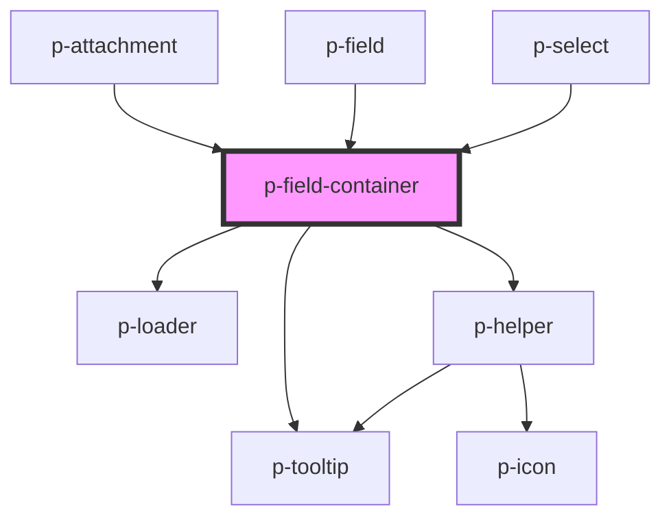

# p-field-container

<!-- Auto Generated Below -->

## Properties

| Property           | Attribute            | Description                                    | Type                                                                                                                                                                 | Default                         |
| ------------------ | -------------------- | ---------------------------------------------- | -------------------------------------------------------------------------------------------------------------------------------------------------------------------- | ------------------------------- |
| `align`            | `align`              | Align content to the start or end              | `"end" \| "start"`                                                                                                                                                   | `'start'`                       |
| `error`            | `error`              | The helper of the input group                  | `string`                                                                                                                                                             | `undefined`                     |
| `errorPlacement`   | `error-placement`    | The placement of the error popover             | `"bottom" \| "bottom-end" \| "bottom-start" \| "left" \| "left-end" \| "left-start" \| "right" \| "right-end" \| "right-start" \| "top" \| "top-end" \| "top-start"` | `undefined`                     |
| `forceShowTooltip` | `force-show-tooltip` | Force show the error tooltip                   | `boolean`                                                                                                                                                            | `false`                         |
| `helper`           | `helper`             | The helper of the input group                  | `HTMLSlotElement \| string`                                                                                                                                          | `undefined`                     |
| `id`               | `id`                 | The id for the label                           | `string`                                                                                                                                                             | `undefined`                     |
| `label`            | `label`              | The label of the input group                   | `HTMLSlotElement \| string`                                                                                                                                          | `undefined`                     |
| `loading`          | `loading`            | Wether the field container is in loading state | `boolean`                                                                                                                                                            | `false`                         |
| `loadingSize`      | `loading-size`       | The size of the loader                         | `"base" \| "sm"`                                                                                                                                                     | `'base'`                        |
| `optionalTemplate` | --                   | The template for the optional text             | `() => string`                                                                                                                                                       | `this._defaultOptionalTemplate` |
| `required`         | `required`           | Wether the field is required                   | `boolean`                                                                                                                                                            | `undefined`                     |
| `showOptional`     | `show-optional`      | Wether to show optional when not required      | `boolean`                                                                                                                                                            | `true`                          |
| `variant`          | `variant`            | The variant of the field container             | `"read" \| "write"`                                                                                                                                                  | `undefined`                     |

## Events

| Event   | Description | Type                |
| ------- | ----------- | ------------------- |
| `focus` |             | `CustomEvent<void>` |

## Dependencies

### Used by

 - [p-attachment](../../attachment)
 - [p-field](../field)
 - [p-select](../../select)

### Depends on

- [p-loader](../../../atoms/loader)
- [p-helper](../../../atoms/helper)
- [p-tooltip](../../../atoms/tooltip)

### Graph

----------------------------------------------

*Built with [StencilJS](https://stenciljs.com/)*
