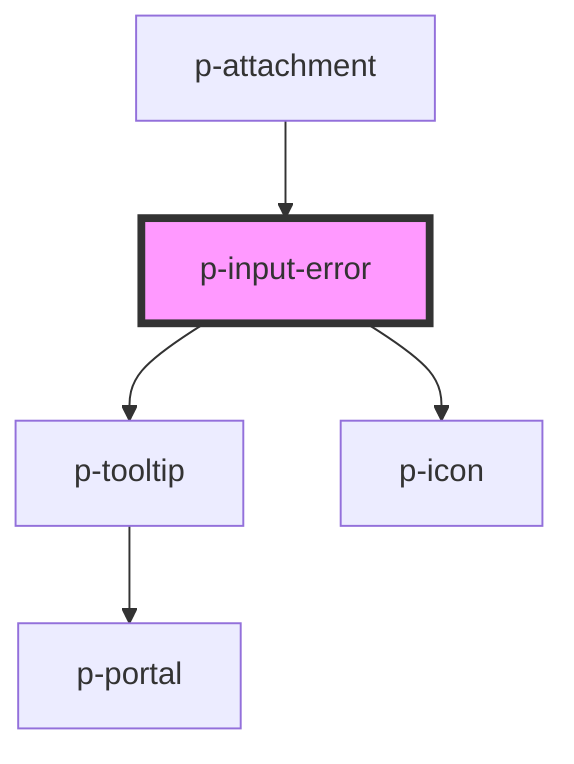

# p-input-error

<!-- Auto Generated Below -->

## Properties

| Property           | Attribute            | Description                      | Type      | Default     |
| ------------------ | -------------------- | -------------------------------- | --------- | ----------- |
| `error`            | `error`              | The error to show                | `string`  | `undefined` |
| `forceShowTooltip` | `force-show-tooltip` | Wether to force show the tooltip | `boolean` | `false`     |

## Dependencies

### Used by

 - [p-attachment](../attachment)

### Depends on

- [p-tooltip](../../atoms/tooltip)
- [p-icon](../../atoms/icon)

### Graph

----------------------------------------------

*Built with [StencilJS](https://stenciljs.com/)*
