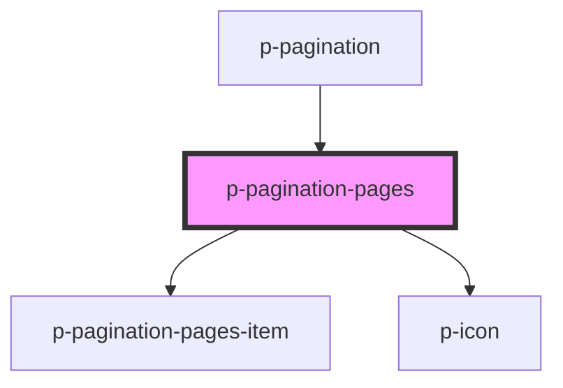

# p-pagination-pages

<!-- Auto Generated Below -->

## Properties

| Property             | Attribute             | Description                                        | Type      | Default                        |
| -------------------- | --------------------- | -------------------------------------------------- | --------- | ------------------------------ |
| `hideOnSinglePage`   | `hide-on-single-page` | Wether to hide when there is only 1 page available | `boolean` | `false`                        |
| `page`               | `page`                | The current page                                   | `number`  | `1`                            |
| `pageSize`           | `page-size`           | The amount of items per page                       | `number`  | `PAGINATION_DEFAULT_PAGE_SIZE` |
| `total` _(required)_ | `total`               | The total amount of items                          | `number`  | `undefined`                    |

## Events

| Event         | Description                     | Type                  |
| ------------- | ------------------------------- | --------------------- |
| `pageChange`  | Event whenever the page changes | `CustomEvent<number>` |
| `pagesChange` | The pages that were generated   | `CustomEvent<number>` |

## Dependencies

### Used by

 - [p-pagination](../pagination)

### Depends on

- [p-pagination-pages-item](../../../atoms/pagination/pages-item)
- [p-icon](../../../atoms/icon)

### Graph

----------------------------------------------

*Built with [StencilJS](https://stenciljs.com/)*
