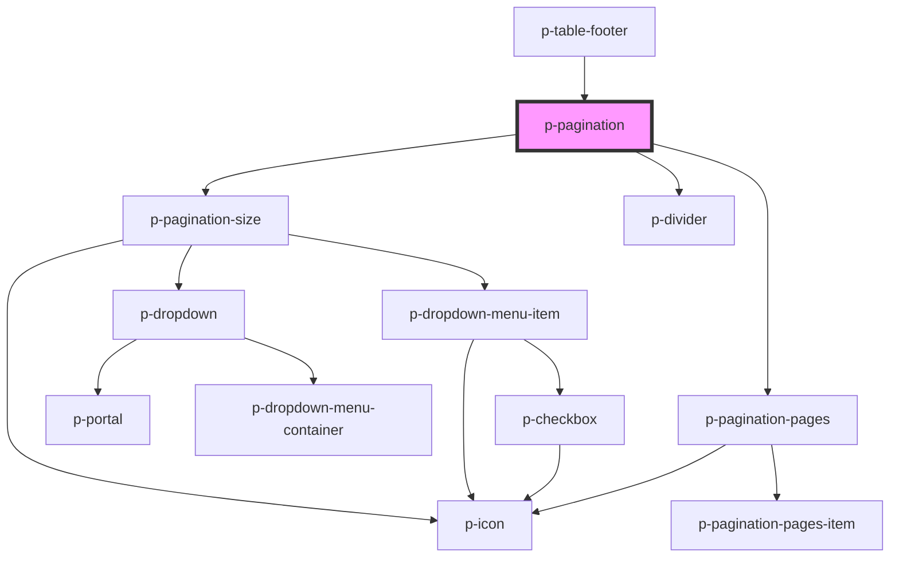

# p-pagination

<!-- Auto Generated Below -->

## Properties

| Property                | Attribute                 | Description                                        | Type       | Default              |
| ----------------------- | ------------------------- | -------------------------------------------------- | ---------- | -------------------- |
| `enablePaginationPages` | `enable-pagination-pages` | Wether to enable pagination pages                  | `boolean`  | `true`               |
| `enablePaginationSize`  | `enable-pagination-size`  | Wether to enable pagination size select            | `boolean`  | `true`               |
| `hideOnSinglePage`      | `hide-on-single-page`     | Wether to hide when there is only 1 page available | `boolean`  | `true`               |
| `page`                  | `page`                    | The current page                                   | `number`   | `1`                  |
| `pageSize`              | `page-size`               | The amount of items per page                       | `number`   | `defaultSize`        |
| `pageSizeOptions`       | `page-size-options`       | The options for the page size                      | `number[]` | `defaultSizeOptions` |
| `total` _(required)_    | `total`                   | The total amount of items                          | `number`   | `undefined`          |

## Events

| Event            | Description                     | Type                  |
| ---------------- | ------------------------------- | --------------------- |
| `pageChange`     | Event whenever the page changes | `CustomEvent<number>` |
| `pagesChange`    | The pages that were generated   | `CustomEvent<number>` |
| `pageSizeChange` | Event whenever the page changes | `CustomEvent<number>` |

## Dependencies

### Used by

 - [p-table-footer](../../table/footer)

### Depends on

- [p-pagination-size](../size)
- [p-divider](../../../atoms/divider)
- [p-pagination-pages](../pages)

### Graph

----------------------------------------------

*Built with [StencilJS](https://stenciljs.com/)*
