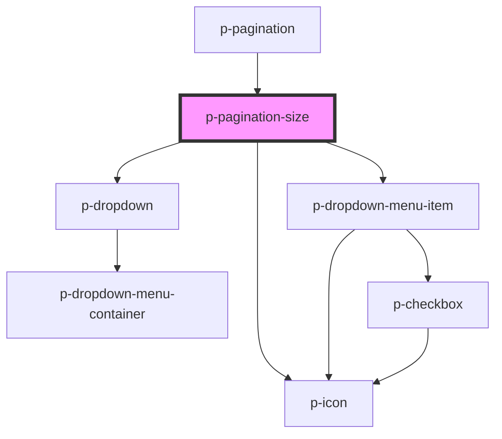

# p-pagination-size

<!-- Auto Generated Below -->

## Properties

| Property       | Attribute       | Description                                        | Type                        | Default                                |
| -------------- | --------------- | -------------------------------------------------- | --------------------------- | -------------------------------------- |
| `hidden`       | `hidden`        | Wether to hide when there is only 1 page available | `boolean`                   | `false`                                |
| `itemTemplate` | `item-template` | The template for the data view                     | `(value: number) => string` | `this._defaultItemTemplate`            |
| `size`         | `size`          | The current page                                   | `number`                    | `PAGINATION_DEFAULT_PAGE_SIZE`         |
| `sizeOptions`  | `size-options`  | The available sizes                                | `number[]`                  | `PAGINATION_DEFAULT_PAGE_SIZE_OPTIONS` |

## Events

| Event        | Description                     | Type                  |
| ------------ | ------------------------------- | --------------------- |
| `sizeChange` | Event whenever the size changes | `CustomEvent<number>` |

## Dependencies

### Used by

 - [p-pagination](../pagination)

### Depends on

- [p-dropdown](../../dropdown)
- [p-icon](../../../atoms/icon)
- [p-dropdown-menu-item](../../../atoms/dropdown-menu/item)

### Graph

----------------------------------------------

*Built with [StencilJS](https://stenciljs.com/)*
