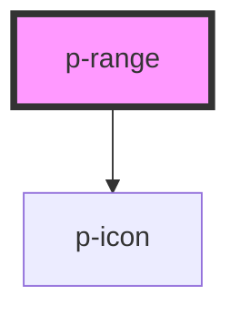

# p-range

<!-- Auto Generated Below -->

## Properties

| Property | Attribute | Description                    | Type     | Default |
| -------- | --------- | ------------------------------ | -------- | ------- |
| `max`    | `max`     | The max value of the range     | `number` | `100`   |
| `min`    | `min`     | The min value of the range     | `number` | `0`     |
| `step`   | `step`    | The steps to go by             | `number` | `0.5`   |
| `value`  | `value`   | The current value of the range | `number` | `0`     |

## Events

| Event         | Description                      | Type                  |
| ------------- | -------------------------------- | --------------------- |
| `valueChange` | Event whenever the value changes | `CustomEvent<string>` |

## Dependencies

### Depends on

- [p-icon](../../atoms/icon)

### Graph

----------------------------------------------

*Built with [StencilJS](https://stenciljs.com/)*
