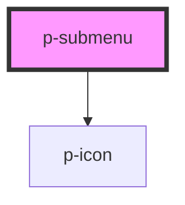

# p-divider

<!-- Auto Generated Below -->

## Properties

| Property    | Attribute    | Description                         | Type      | Default |
| ----------- | ------------ | ----------------------------------- | --------- | ------- |
| `active`    | `active`     | Wether the submenu is active or not | `boolean` | `false` |
| `index`     | `index`      | Index of the submenu                | `number`  | `0`     |
| `open`      | `open`       | Wether the submenu is open or not   | `boolean` | `false` |
| `showIndex` | `show-index` | Wether to show the index            | `boolean` | `true`  |
| `subtitle`  | `subtitle`   | Subtitle of the submenu             | `string`  | `''`    |
| `title`     | `title`      | Title of the submenu                | `string`  | `''`    |

## Dependencies

### Depends on

- [p-icon](../../../atoms/icon)

### Graph

----------------------------------------------

*Built with [StencilJS](https://stenciljs.com/)*
