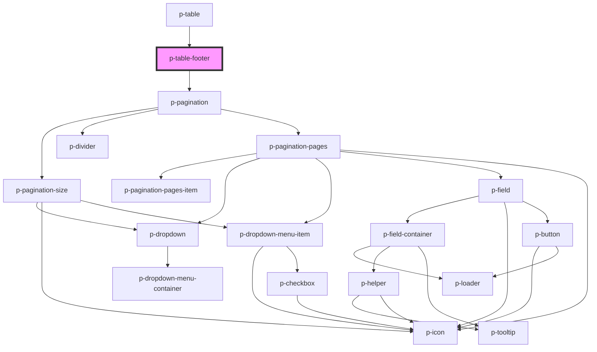

# p-table-footer

<!-- Auto Generated Below -->

## Properties

| Property                | Attribute                 | Description                                                   | Type       | Default                                |
| ----------------------- | ------------------------- | ------------------------------------------------------------- | ---------- | -------------------------------------- |
| `enablePaginationPages` | `enable-pagination-pages` | Wether to enable pagination pages                             | `boolean`  | `true`                                 |
| `enablePaginationSize`  | `enable-pagination-size`  | Wether to enable pagination size select                       | `boolean`  | `true`                                 |
| `hideOnSinglePage`      | `hide-on-single-page`     | Wether to hide when there is only 1 page available            | `boolean`  | `true`                                 |
| `loading`               | `loading`                 | Wether we want to show loading state                          | `boolean`  | `false`                                |
| `page`                  | `page`                    | The current page                                              | `number`   | `1`                                    |
| `pageSize`              | `page-size`               | The amount of items per page                                  | `number`   | `PAGINATION_DEFAULT_PAGE_SIZE`         |
| `pageSizeOptions`       | `page-size-options`       | The options for the page size                                 | `number[]` | `PAGINATION_DEFAULT_PAGE_SIZE_OPTIONS` |
| `tableHeaderHasAction`  | `table-header-has-action` | Wether the table header has an action to adjust for on mobile | `boolean`  | `false`                                |
| `total` _(required)_    | `total`                   | The total amount of items                                     | `number`   | `undefined`                            |

## Events

| Event            | Description                                | Type                   |
| ---------------- | ------------------------------------------ | ---------------------- |
| `hiddenChange`   | Event whenever the footer is hidden or nog | `CustomEvent<boolean>` |
| `pageChange`     | Event whenever the page changes            | `CustomEvent<number>`  |
| `pageSizeChange` | Event whenever the page changes            | `CustomEvent<number>`  |

## Dependencies

### Used by

 - [p-table](../../../organisms/table)

### Depends on

- [p-pagination](../../pagination/pagination)

### Graph

----------------------------------------------

*Built with [StencilJS](https://stenciljs.com/)*
